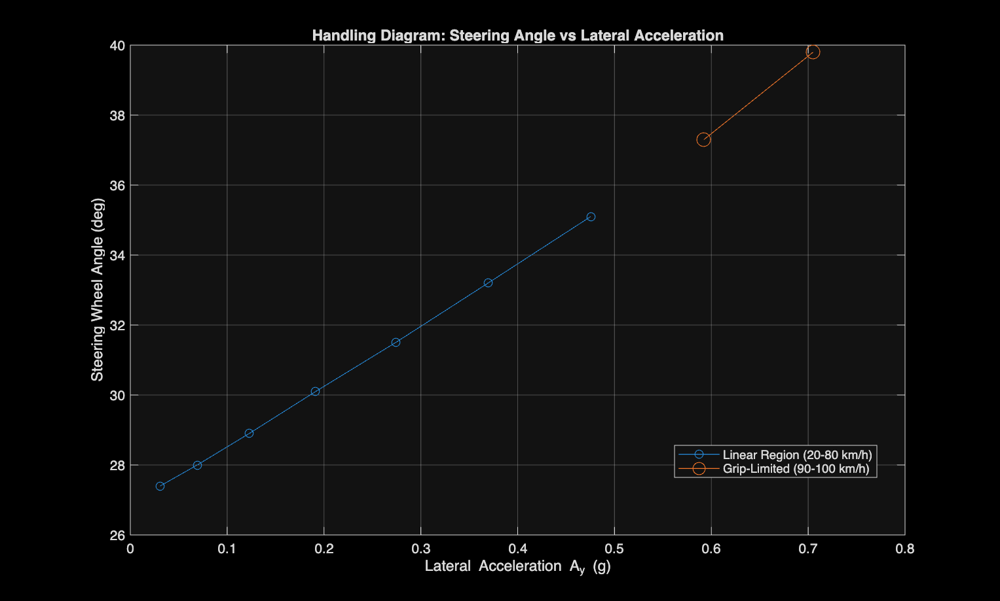
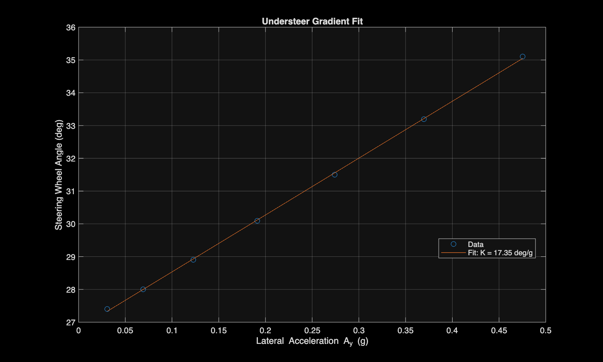
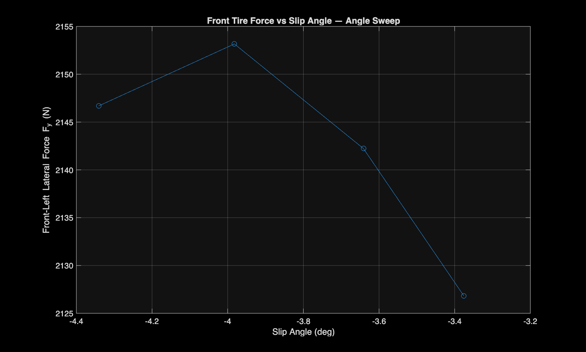
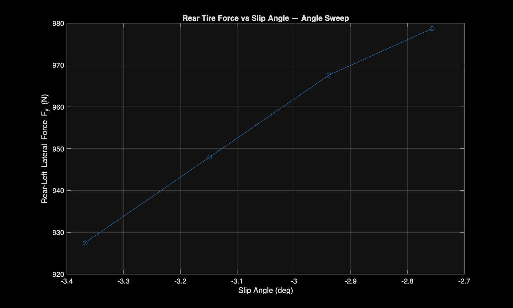

# Test 1: Constant-Radius Cornering & Grip-Limit Sweep

**Objectives:** Characterize how steering demand scales with lateral acceleration in the linear handling range, quantify the understeer gradient, and find where the vehicle's cornering grip ceiling actually sits.

---

## Setup

- **Control mode:** Constant target speed, Steering: Constant (Open Loop), no braking
- **Target radius:** 100 m
- **Speeds run:** 20–100 km/h

A fixed steering angle doesn't produce the same radius at every speed, since understeer changes how much the car actually turns for a given input. Instead of guessing angles by trial and error, a two-point calibration was used to derive a linear relationship:

```
δ = C/R + K × Ay
```
- δ = steering wheel angle (deg)
- R = target radius (m)
- Ay = lateral acceleration (g) = v² / (R × 9.81)
- C, K = constants specific to this car, solved from two calibration runs

**Calibration runs:**
- 30 km/h, 20° steering → ~140 m radius achieved
- 60 km/h, 30° steering → ~105 m radius achieved

Solving these gave an initial estimate of **K ≈ 16.5 deg/g**, which was used to build a steering angle table (27.4°–35.1° across 20–90 km/h) so each speed run held close to the 100 m target radius.

---

## Findings

### Understeer Gradient
A linear regression across the 7 linear-region points (20–80 km/h) gives **K = 17.35 deg/g**, within about 5% of the initial two-point estimate. The 7 points sit almost exactly on the regression line, so the vehicle is behaving linearly across this speed range as expected.





### Grip Limit Onset
At 90–100 km/h, the car couldn't hold the 100 m radius anymore with the calculated angle. The path widened outward instead, marking the exit from the linear handling region. Lateral acceleration rose from **0.59g at 90 km/h to 0.71g at 100 km/h**, which shows grip-limited behavior but not a plateau yet.

### Grip Ceiling: Front/Rear Axle Split
Ay was still rising even though the tire was visibly slipping, which seemed contradictory at first. The resolution was a distinction that's easy to miss: a tire can be slipping and still be short of its peak force. Slip onset and peak force sit at different points on the tire's force curve, not the same one.

To pin this down, a follow-up sweep was run at a fixed 100 km/h, stepping steering angle from 39.8° to 48° so steering demand was the only thing changing:

- **Front tire lateral force peaked around 4° slip angle at ~2150 N, then dropped off slightly** (2153 N at ~4.0° down to 2127 N at ~4.3°). That's the front axle actually reaching and passing its grip ceiling.
- **Rear tire lateral force never saturated**, climbing steadily from 927 N to 979 N over the same sweep with no sign of a peak.
- **Vehicle-level Ay kept rising through the whole sweep** (0.71g → 0.80g). This was checked against transient noise by comparing the 25%, 50%, and final 10% windows of the 48° run. All read 0.7967g, confirming it's a real steady-state number, not still settling.

<p float="left">
  
  
</p>

**Conclusion:** the front axle hits its limit first, but the car as a whole hasn't hit its limit yet because the rear axle still has room left. The vehicle's grip ceiling is currently rear-limited, not front-limited. Pinning down the exact ceiling would mean extending the sweep until the rear tires saturate too, which wasn't pursued further given the rising risk of instability at higher angles and time constraints. The measured 0.80g, still climbing, lines up with published dry-pavement sedan performance (typically 0.8–0.9g).
