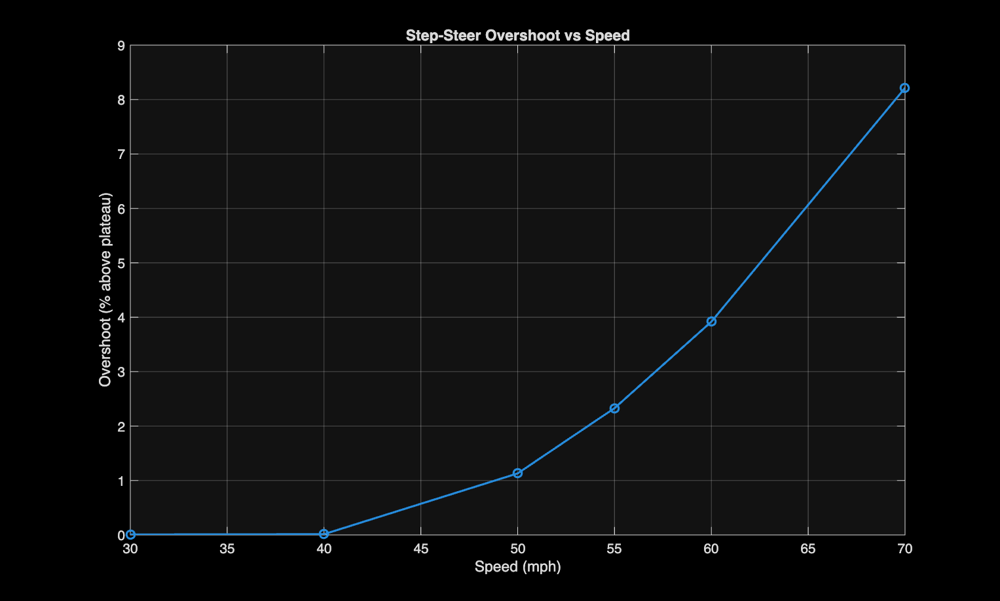

# Test 2: Step-Steer Transient Response

**Objective:** Find the speed at which the car's response to a sudden steering input stops settling cleanly and starts becoming poorly damped, using overshoot as the stability indicator.

---

## Setup

Used CarSim's built-in "transient response" preset (Miscellaneous: Events dropdown) rather than manually building a step input.

**Preset parameters (fixed across all runs):**
```
ay_test = 0.4
level_i = 0.5
level_f = 0.9
time_out = 20
time_settle = 3
```
Only `speed_mph` was varied between runs.

**Speeds run:** 30, 40, 50, 55, 60, 70 mph

Each output file contains the preset's full auto-iteration sequence: one or more initial calibration attempts, followed by a confirmed final event. Only the last peak-and-settle event in each file was used for analysis, isolated with `findpeaks` and a minimum prominence threshold to reject the earlier calibration transients.

---

## Findings

Step-steer overshoot (peak yaw rate relative to the final settled plateau) was measured across all six speeds using only the final calibrated event in each file:

| Speed (mph) | Overshoot (% above plateau) |
|---|---|
| 30 | ~0% |
| 40 | ~0% |
| 50 | ~1.1% |
| 55 | ~2.3% |
| 60 | ~3.9% |
| 70 | ~8.2% |




Overshoot is negligible through 40 mph, then increases sharply and nonlinearly from 50 mph onward. No speed in the tested range showed sustained oscillation (repeated overshoot/undershoot cycles).

---

## Conclusion

The vehicle stays stable throughout the full 30-70 mph range. Damping quality drops off with speed: overshoot is negligible through 40 mph, then climbs sharply from 50 mph onward, nearly quadrupling between 55 and 70 mph. The stability margin is speed-dependent and shrinking well before 70 mph, making it the clear driver of when the response starts to degrade.
