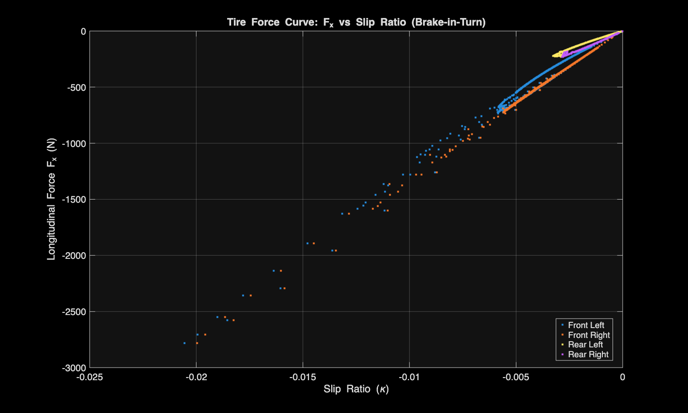
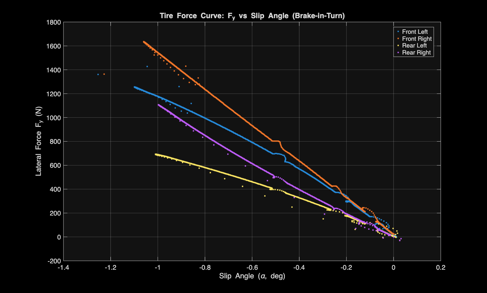
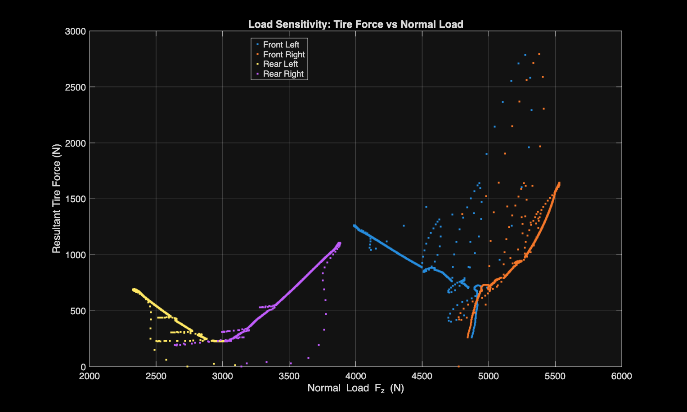
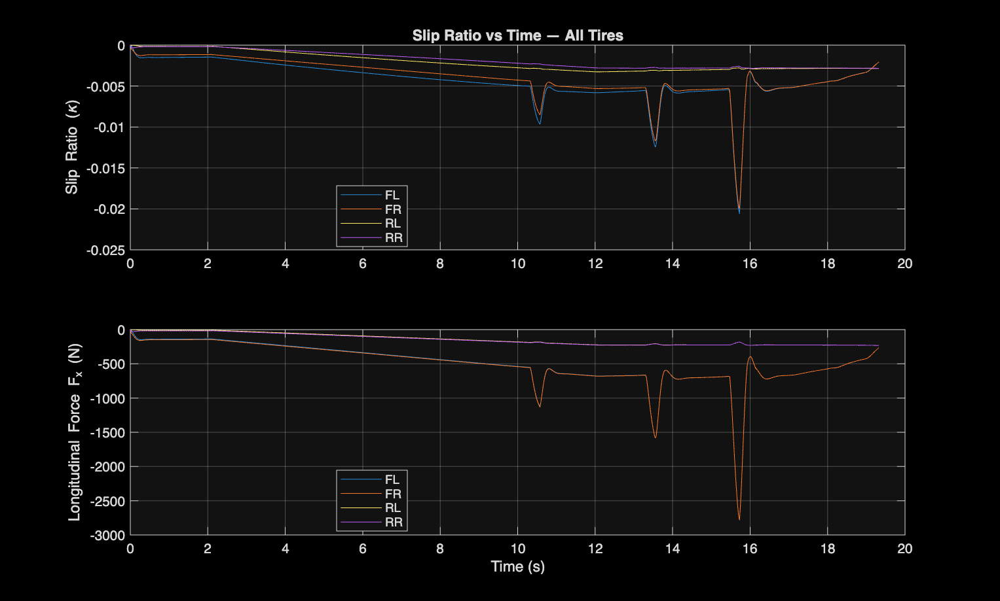
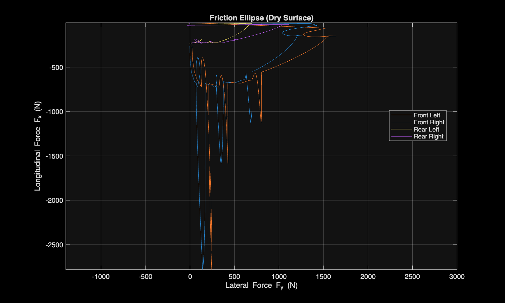

# Test 3: Brake-in-Turn

**Objective:** Characterize how tire forces, load, and slip behave when braking and cornering demand are combined, and identify which axle carries the work.

---

## Setup

- **Initial speed:** 65 km/h
- **Steering:** Constant (Open Loop), 30°
- **Braking:** Control: Braking Pedal Force (Open Loop), ramping 0 to 0.75 MPa starting at t=2s over 10 seconds, reaching full pressure at t=12s and holding flat afterward

The vehicle physically stops under braking around t=22-25s, so data after that point was excluded from analysis.

---

## Findings

Data across all four deliverables tells a consistent story: braking grip is almost entirely a front-axle event.

- **Front tires reach substantially higher longitudinal force** under braking (~2800 N peak) than rear tires (~250 N peak)
- **Front tires carry more normal load** throughout the maneuver (4000-5500 N vs. 2300-3900 N for the rears), consistent with forward weight transfer under braking

- **The friction ellipse** shows the front tires tracing the full grip boundary, while the rear tires remain in a tight cluster near the origin, barely engaged longitudinally

### Transient Grip-Loss Events
Three sharp dips in front-right slip ratio and longitudinal force showed up at approximately t=10.5s, 13.5s, and 15.7s. These coincide with matching oscillations in front-right normal load (Fz). Two alternate explanations were ruled out:
- **ABS activity:** the ABS status flag was constant throughout
- **Brake-input irregularities:** master cylinder pressure command was confirmed smooth via direct plot, no glitches at the event timestamps

---

## Conclusion

Front-biased brake proportioning combined with forward weight transfer concentrates nearly all longitudinal tire work onto the front axle. This shows up consistently across slip ratio, force magnitude, load, and the friction-limit transients, all observed exclusively at the front tires, while the rear tires stay well within their grip envelope for the entire maneuver.

The most consistent explanation for the front-right grip-loss events is the tire transiently exceeding its combined friction limit under peak braking and cornering demand, producing a brief slip event that perturbs suspension load before the tire recovers grip.
