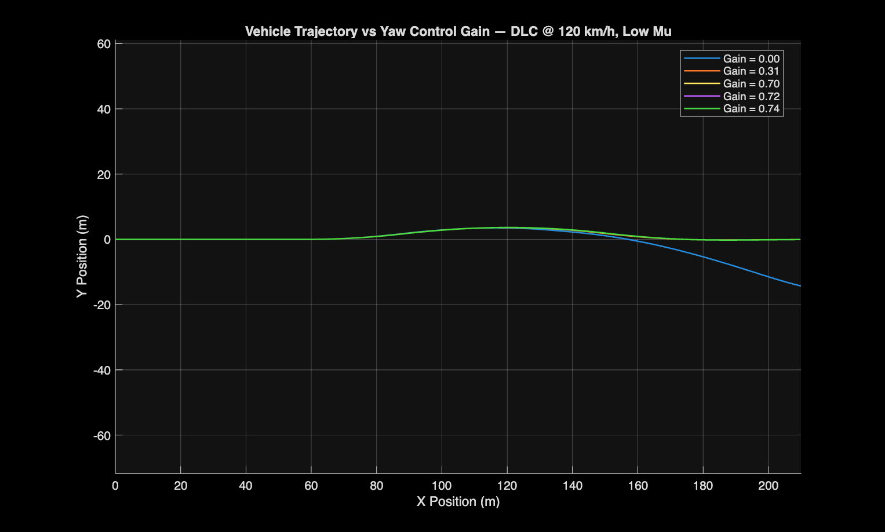
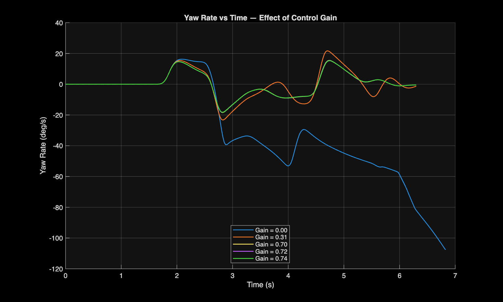
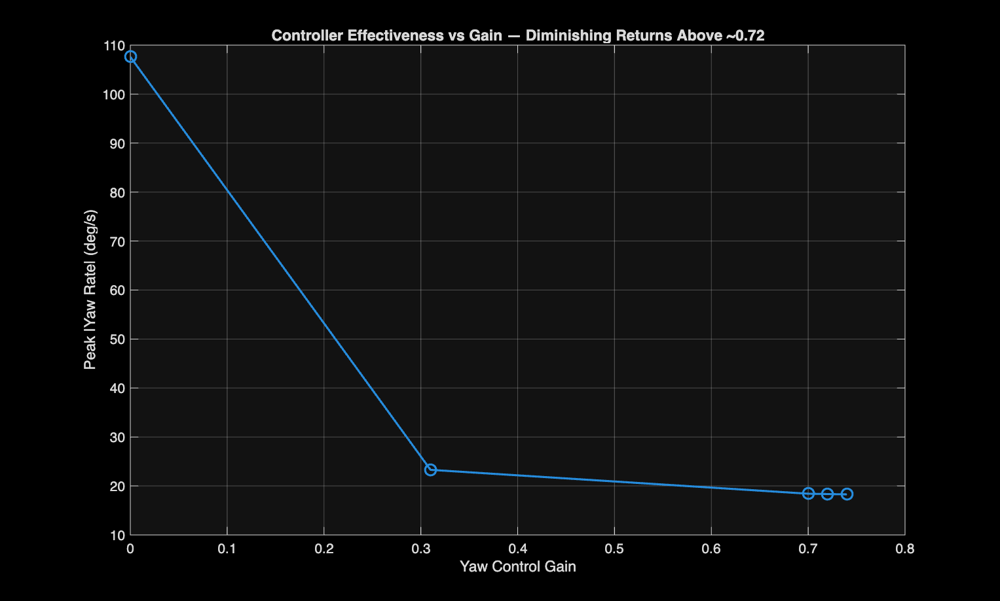

# Test 4: Yaw Control via CarSim-Simulink Co-Simulation

## Objective

Determine whether active rear-differential torque-vectoring yaw control improves vehicle stability during a low-mu double lane change, and characterize how controller effectiveness scales with control gain.

## Setup

Vehicle: B-Class Sports Car (CarSim reference example, kept separate from the D-Class Sedan used in Tests 1-3)

Maneuver: Double lane change at 120 km/h on a low-mu surface, run through live CarSim-Simulink co-simulation (`vs_sf` S-function block)

Controller: masked Yaw Controller subsystem with two parameters, Yaw Rate Control Gain (held fixed at 0.06) and Control Gain (the variable swept). Confirmed via "Look Under Mask" that the controller logic is:

```
error = Slip Angle - (Yaw Rate Gain x Yaw Rate)
       -> dead zone
       -> Control Gain
       -> saturation
       -> split into First Clutch / Second Clutch (Second Clutch inverted)
```

This is a torque-vectoring rear differential. Opposite-signed torque commands to the two clutches bias driving torque left-right, generating a corrective yaw moment independent of steering input.

Unlike Tests 1-3, which ran entirely inside CarSim with the vehicle's response to a fixed input recorded and analyzed after the fact, this test uses live co-simulation between CarSim and Simulink. CarSim computes vehicle and tire physics each timestep, while Simulink runs the Yaw Controller logic and sends clutch torque commands back in real time through the `vs_sf` block. This puts an external controller directly in the loop with CarSim's physics engine rather than testing a fixed, pre-recorded input, and demonstrates a cross-platform simulation workflow, with CarSim and Simulink running simultaneously and exchanging data at every timestep rather than one producing static input for the other to consume afterward.

Five runs were completed, varying only Control Gain: 0, 0.31, 0.70, 0.72, 0.74.

## Findings

Gain 0 (uncontrolled baseline) loses yaw stability outright. Yaw rate grows without bound after the second steering reversal, and the trajectory departs the lane entirely rather than recovering.



Gain 0.31 stays bounded but still oscillates noticeably (peak yaw rate ~23 deg/s, visible overshoot on each reversal). Gains 0.70-0.74 cluster tightly, settling faster with smaller overshoot (peak yaw rate ~18 deg/s), and showed no visible slippage during the maneuver.



Peak yaw rate drops sharply from gain 0 to 0.31, then flattens from 0.70 to 0.74, showing diminishing returns above roughly 0.72.



At gain 0, the failure is a clear yaw instability event, with the vehicle spinning out and never recovering. At gain 0.31 the vehicle stays bounded but still shows meaningful oscillation and marginal handling through the maneuver. At gain 0.72, the vehicle clears the double lane change cleanly, remaining rotationally composed throughout with no visible slippage. This confirms 0.72 as the effective operating point identified through the gain sweep, consistent with the plateau seen in peak yaw rate above roughly 0.70.

## Conclusion

Active yaw-rate/slip-angle feedback control through the rear differential is what allows the vehicle to complete a severe low-mu double lane change at 120 km/h. Sweeping the gain from 0 to 0.74 showed most of the stability improvement occurring between gain 0 and roughly 0.70, after which peak yaw rate flattens out. Gain 0.72 was confirmed as the effective tuned value, clearing the maneuver cleanly with no visible instability, while lower gains either failed outright (gain 0) or remained marginal (gain 0.31). This test demonstrates a full closed-loop CarSim-Simulink co-simulation workflow, using a live external controller to stabilize the vehicle in a maneuver it could not complete without control.
